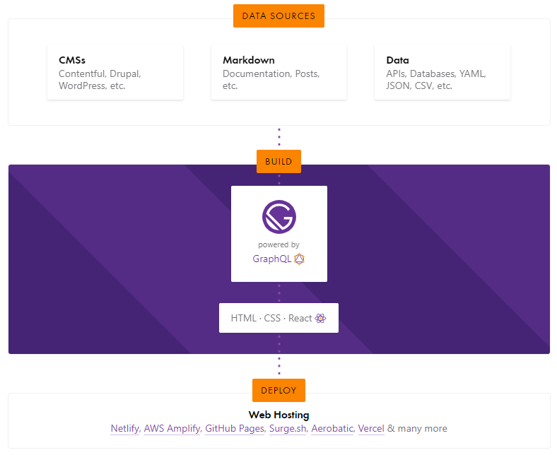

首を寝違えて鈍痛がします。。

家内曰く、上を向いて「いーうーいーうー」っていった後に後ろ手で組んだ手をゆすると良いというのでなんどが試していますが効果はいまひとつです。。

## ブログ

さて、GW中に色々調べたらJAMstackとかそういうのがあるんだなぁと知ったので、私もそういう感じのものにチャレンジしてみました。

Gatsby + GitHub + Netlify で静的サイト生成する方式をお試ししてます。
HUGOの方がページ生成早そうだったけど、そんなに速度は今のところ気にならないので、
とりあえずGatsbyで初めてみました。

ちなみに Notion + Vercel の仕組みも試したのですが、なぜか上手くできず・・・

まあNotionも素晴らしいけど単純な文章コンテンツはMarkdownとかなるべく生なテキストに近い形で運用する方が情報資産としての寿命は長くなりますよね。

というわけでコンテンツ編集はヘッドレスCMSとかは使わずに、vscodeでやってます。

普段の仕事では Gatsby も Git も Markdown も触らないので良くわかっていませんが、ちょっとづつ調べて更新したいと思います。

[Gatsbyのサイト](https://www.gatsbyjs.org/)

Gatsby自体は上の図にあるような仕組みみたいですね。
React も GraphQL も全然分からないけど・・・

私が今回試したのはこんな感じの構成でしょうね。

WordPress とかでサイト立てると、セキュリティ対策大変なので、
こういう方法もあるのはありがたいですね。ほんと。

